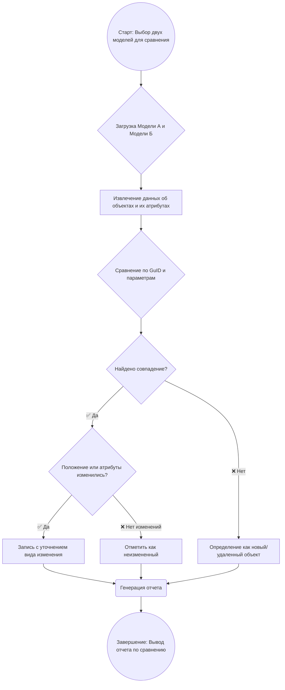

# BIM-compare


## ✨ Описание проекта

BIM-compare — инструмент для работы с цифровыми информационными моделями зданий. Он позволяет автоматизировать рутинные задачи, такие как отслеживание положения объектов, сравнение версий моделей и проверку атрибутивных данных. Наша цель — обеспечить точность и корректность BIM-данных на всех этапах жизненного цикла проекта.

## 🛠️ Основные возможности

⦁	🔍 Отслеживание изменений: автоматическое определение перемещений, добавлений или удалений элементов модели.

⦁	⚖️ Сравнение моделей: выявление различий между двумя версиями BIM-модели.

⦁	📝 Проверка атрибутов: автоматический контроль полноты и корректности атрибутивной информации элементов.

## 📂 Поддерживаемые форматы

|Формат|Расширение|Использование|
|:---:|:---:|---|
|IFC|.ifc|Чтение, возможна запись, полный анализ|
|RVT|.rvt|Чтение, ограниченный анализ|
|NWC|.nwc|Чтение, просмотр|
|DWG|.dwg|Чтение, ограниченный анализ|

## 📊 Логика работы



## 🚀 Установка

1.	⬇️ Установите зависимости:

```bash
pip install -r requirements.txt.
```

2.	🚀 Запустите основной скрипт:

```bash
python main.py
```

4.	📖 Ознакомьтесь с документацией для получения полного списка команд и опций.
